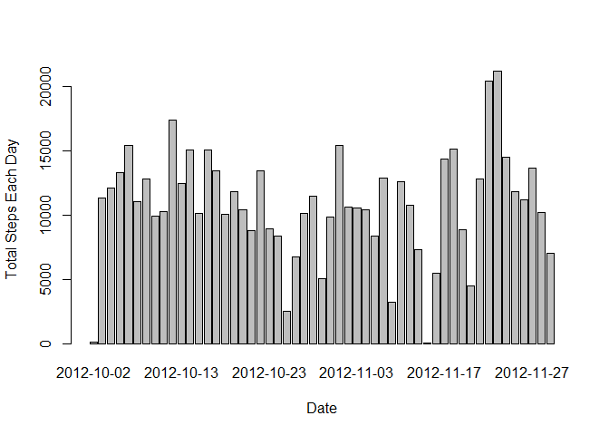

# Reproducible Research: Peer Assessment 1


## Loading and preprocessing the data


```r
unzip("activity.zip")
activity <- read.csv("activity.csv")
```

## What is mean total number of steps taken per day?

### 1. Make a histogram of the total number of steps taken each day


```r
steps.date <- aggregate(steps ~ date, data = activity, FUN = sum)
barplot(steps.date$steps, names.arg = steps.date$date, xlab = "Date", ylab = "Total Steps Each Day")
```

 

### 2. Calculate and report the mean and median total number of steps taken per day


```r
mean(steps.date$steps)
```

```
## [1] 10766.19
```


```r
median(steps.date$steps)
```

```
## [1] 10765
```


## What is the average daily activity pattern?


## Imputing missing values


## Are there differences in activity patterns between weekdays and weekends?
